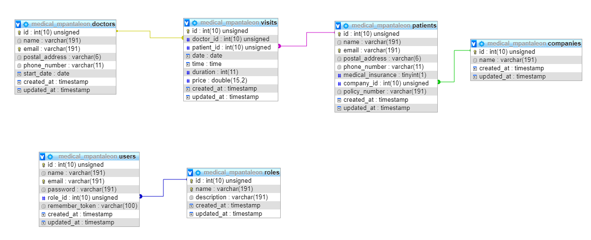

# Laravel Project Report 
#### Matthew Pantaleon

---

## Table of Contents
1. [Database](#Database)
	* [Migrations](#migrations)
2. [Migrations](#example2)
3. [Seeders](#third-example)
4. [Models](#third-example)
5. [Tinker](#Tinker)

---

### Database

The database structure consists of 6 main tables. Patients, Doctors, Visits, companies, users and roles. <br>
Patients and doctors have a many-to-many relation ship through the visits table. <br>
Patients can have one company and a company can have many patients. Making it a one-to-many.
Users can only have one role and a role can have multiple users. Also making it a one-to-many.

below it the structure of the database.



---

#### Migrations

Migrations are what laravel uses to be able to create database tables.
I used comamnds the artisan command e.g.`php artisan make:migration create_doctors_table` to create blank migration files. I created one for each table I need. With the exception of the users table I used `php artisan make:auth` This creates all the user related migration, model, view ad controller files for user functionality. Login and register.

I edited each file to have any columns I wanted it each table and added constraints to the table where it was needed. For example the visits table.


```php

<?php
use Illuminate\Support\Facades\Schema;
use Illuminate\Database\Schema\Blueprint;
use Illuminate\Database\Migrations\Migration;

class CreateVisitsTable extends Migration
{
    
    public function up()
    {
		//creates the columns of the visits table
        Schema::create('visits', function (Blueprint $table) {
            $table->increments('id');
            $table->integer('doctor_id')->unsigned();
            $table->integer('patient_id')->unsigned();
			$table->date('date');
			$table->time('time');
			$table->integer('duration');
			$table->double('price', 15, 2);
            $table->timestamps();
			
			//adds foriegn keys on doctors_id and patients_id on doctors and patients table respectively
			$table->foreign('doctor_id')->references('id')->on('doctors');
			$table->foreign('patient_id')->references('id')->on('patients');
        });
    }

    
    public function down()
    {
        Schema::dropIfExists('visits');
    }
}

```


