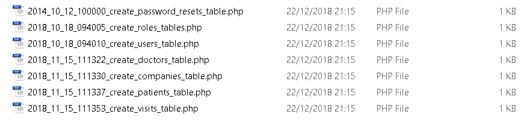

# Laravel Project Report 
#### Matthew Pantaleon

---

## Table of Contents
1. [Laravel](#laravel)
1. [Database](#Database)
	* [Migrations](#migrations)
		 * [ENV](#ENV)
2. [Models](#models)
3. [Seeders](#seeders)
4. [Routes](#routes)
5. [Tinker](#Tinker)

---

### Laravel

First thing I did was create a new laravel application. I made sure I had composer installed and made sure that the command prompt knows where composer was I typed in `composer global require laravel/installer` to get the laravel instaler. Again I made sure the command prompt knows what laravel is then I typed in `laravel new blog`. While working on different machines in the college I was not able to use laravel it self so I typed a composer comamnd that does the same thing `composer create-project --prefer-dist laravel/laravel NAME`. NAME is the name of the laravel application that will be created.

### Database

Now that I have fresh laravel application I moved on to the database. The database structure consists of 6 main tables. Patients, Doctors, Visits, companies, users and roles. <br>
Patients and doctors have a many-to-many relation ship through the visits table. <br>
Patients can have one company and a company can have many patients. Making it a one-to-many.
Users can only have one role and a role can have multiple users. Also making it a one-to-many.

below it the structure of the database.


---

#### Migrations
With the structure of the database down I needed to create the tables. Laravel ofers migrations. Migrations are what laravel uses to be able to create database tables.
I used comamnds the artisan command e.g.`php artisan make:migration create_doctors_table` to create blank migration files. I created one for each table I need. With the exception of the users table I used `php artisan make:auth` This creates all the user related migration, model, view ad controller files for user functionality. Login and register.

I edited each file to have any columns I wanted it each table and added constraints to the table where it was needed. For example the visits table.

```php

<?php
use Illuminate\Support\Facades\Schema;
use Illuminate\Database\Schema\Blueprint;
use Illuminate\Database\Migrations\Migration;

class CreateVisitsTable extends Migration
{
    
    public function up()
    {
		//creates the columns of the visits table
        Schema::create('visits', function (Blueprint $table) {
            $table->increments('id');
            $table->integer('doctor_id')->unsigned();
            $table->integer('patient_id')->unsigned();
			$table->date('date');
			$table->time('time');
			$table->integer('duration');
			$table->double('price', 15, 2);
            $table->timestamps();
			
			//adds foriegn keys on doctors_id and patients_id on doctors and patients table respectively
			$table->foreign('doctor_id')->references('id')->on('doctors');
			$table->foreign('patient_id')->references('id')->on('patients');
        });
    }

    
    public function down()
    {
        Schema::dropIfExists('visits');
    }
}

```

<br>

After migrating one a SQL an error is returned saying *specified key was too long*. This is because the xampp version that we use runs on an SQL version lower than what laravel supports by default. To fix this I went to the *AppServiceProvider* file and edited as such:

```php

<?php

namespace App\Providers;

use Illuminate\Support\ServiceProvider;
use Illuminate\Support\Facades\Schema; //imports the Schema class

class AppServiceProvider extends ServiceProvider
{
    public function boot()
    {
        Schema::defaultStringLength(191); // fizes SQL error of key being too long
    }
}

```


<br>
Since my tables have foriegn key constraints, the foriegn key constraints must be unsigned integers and the order in which the migrations or executed is very important. If I migrate the visits table first before either the codtors or patients. Laravel will return an SQL error. I have a similar situation for companies and patients where companies table must be created first.
<br>

Laravel executes the migrations based on the date order of the files. As shown here the visits table is the last file to be migrated. I didn't know it did this as I made my visits migration file before my patients file after realising this then changed the date on the visits migration.




#### ENV

Now that I had my migrations laravel needs to know where I'm migrating the files to, to create databae tables. In the ENV file in the root of the application I made sure that the databse name exists and set the username and pasword for phpMyAdmin.

```javascipt

DB_CONNECTION=mysql
DB_HOST=127.0.0.1
DB_PORT=3306
DB_DATABASE=medical
DB_USERNAME=root
DB_PASSWORD=

```
---

Now Laravel knows where to migrate the files. I migrated them using the command: `php artisan migrate` and this will create empty tables in the database as well as a migrations table to keep a record of all the migrations that laravel has executed. If I found out that there was something I missed in the migrations or an error then I fix it. I can execute: `php artisan migrate:refresh`. This will rollback all existing migrations and migrate again.
<br>

Now there are empty tables in database we need data to initially populate the tables.

---


### Models
Before wI seeded the database, I needed to create the models. Models are the way laravel converts database data into PHP objects for use the application and vice-versa save into the database. Using the command: `php artisan make:model Name` where name is the name of the blank model class that is to be created for a specific table. By default the model will assume the name of its table is the plural of its name. If you have a different table name from the one that laravel uses by default, you can set `$table` to a custom name. I set my table name to what laravel would use to be on the safe side.
<br>

While migrations deal with database creation and databse constraints. Models are used to create objects and create relational queries based on the database constraints.
<br>

Below are the models for doctors, patients and visits. There are more models in my project but these three highlight the core principles of models.

Doctor Model:
```php

<?php

namespace App;

use Illuminate\Database\Eloquent\Model;

class Doctor extends Model
{
	protected $table = 'doctors';
	
    public function visits(){
		return $this->hasMany('App\Visit');
	}
}

```

<br>

Patient Model:
```php

<?php

namespace App;

use Illuminate\Database\Eloquent\Model;

class Patient extends Model
{
	protected $table = 'patients';
    
	public function company(){
		return $this->belongsTo('App\Company');
	}
	
	public function visits(){
		return $this->hasMany('App\Visit');
	}
}

```

<br>

Visit Model:
```php

<?php

namespace App;

use Illuminate\Database\Eloquent\Model;

class Visit extends Model
{
	protected $table = 'visits';
	
    public function patient(){
		return $this->belongsTo('App\Patient');
	}
	
	public function doctor(){
		return $this->belongsTo('App\Doctor');
	}
}

```
<br>


This allows laravel to retrieve data relative from other tables. I.e. `Patient::all()->first()->visits()` this will return all visits for the first patient in the database. One-to-Many. `Visit::all()->last()->doctor()->name` this will return the doctor name for the last visit in the database. One-to-Many inverse.
<br>

I used `php artisan tinker` to test the relational queries as I went along to make sure the queries worked.

---

### Seeders
Seeders are a way to automatically seed tables with immediate data, mainly used for testing and setup purposes.

To quickly duplicate blank seeder files I used the comamnds: `php artisan make:seeder UsersTableSeeder`, `php artisan make:seeder DoctorsTableSeeder`. etc... for each model class.

<br>
With the models defined putting data in the databse becomes easier as I can just create each table's repective model objects and save them.

For example the *VisitsTableSeeder.php*:

```php

<?php

use Illuminate\Database\Seeder;
use App\Role;
use App\User;
use App\Doctor;
use App\Visit;
use App\Patient;

class VisitsTableSeeder extends Seeder
{
    /*		Table Reference
	
     		$table->increments('id');
            $table->integer('doctor_id')->unsigned();
            $table->integer('patient_id')->unsigned();
			$table->date('date');
			$table->time('time');
			$table->integer('duration');
			$table->double('price', 15, 2);
            $table->timestamps();
     */
	 
    public function run()
    {
		$visit1 = new Visit();
		$visit1->doctor_id = Doctor::where('email', 'Al@Gore.com')->first()->id;
		$visit1->patient_id = Patient::where('email', 'Kyle@Reed.com')->first()->id;
		$visit1->date = '2017-05-20';
		$visit1->time = '12:00';
		$visit1->duration = 30;
		$visit1->price = 65.00;
		$visit1->save();
		
		$visit1 = new Visit();
		$visit1->doctor_id = Doctor::where('email', 'Al@Gore.com')->first()->id;
		$visit1->patient_id = Patient::where('email', 'danny@phantom.com')->first()->id;
		$visit1->date = '2017-05-22';
		$visit1->time = '12:00';
		$visit1->duration = 30;
		$visit1->price = 65.00;
		$visit1->save();
		
		$visit1 = new Visit();
		$visit1->doctor_id = Doctor::where('email', 'dr@suess.com')->first()->id;
		$visit1->patient_id = Patient::where('email', 'carl@boone.com')->first()->id;
		$visit1->date = '2017-05-22';
		$visit1->time = '12:00';
		$visit1->duration = 30;
		$visit1->price = 65.00;
		$visit1->save();
		
    }
}

```

To seed the tables I used the command: `php artisan db:seed`. Migrations used date stamps in their name to determine execute order but the seed command goes to *DatabaseSeeder.php* and executes each seeder file line by line, so it is important that tables that have constraints on other tables be seeded last to ensure integrity. Using the Model's ability to do relational queries, seeder values that need values from other tables are never fully hardcoded. Further enforcing foriegn key constraints.
<br>


Here Users belongs to Roles. So Roles are seeded first, Patients belong to Companies and Visits belongs to Doctors and Patients and is seeded last.

```php

<?php

use Illuminate\Database\Seeder;

class DatabaseSeeder extends Seeder
{
    
    public function run()
    {
        $this->call(RolesTableSeeder::class);
        $this->call(UsersTableSeeder::class);
        $this->call(DoctorsTableSeeder::class);
        $this->call(CompaniesTableSeeder::class);
        $this->call(PatientsTableSeeder::class);
		$this->call(VisitsTableSeeder::class);
    }
}

```

<br>

---

Once I have fully checked that the Model realtionships are working. The front end of the application now gets done.
<br>

### Routes

Routes are how users navigate through your site, however many pages you make it. Since my project has roles, routes are the first place where these roles really show on what can be accessed. I have an admin and user role I made it so that admins can create, read, update and delete all three types. Doctors, patients and visits. While users can CRUD visits but only read doctors and patients.
<br>

```php
<?php

Route::get('/', function () {
    return view('welcome');
});

Auth::routes();

Route::get('/home', 'HomeController@index')->name('home');
Route::get('admin/home', 'HomeController@index')->name('admin.home');
Route::get('user/home', 'HomeController@index')->name('user.home');

Route::resource('admin/doctors', 'admin\DoctorController', array("as" => "admin"))->middleware('auth');
Route::resource('admin/patients', 'admin\PatientController', array("as" => "admin"))->middleware('auth');
Route::resource('admin/visits', 'admin\VisitController', array("as" => "admin"))->middleware('auth');
//Route::resource('user/doctors', 'user\DoctorController', array("as" => "user"));

//Route::resource('/doctors', 'user\DoctorController', array("as" =>"user"));
Route::get('/doctors', 'user\DoctorController@index')->name('user.doctors.index')->middleware('auth');
Route::get('/doctors/{doctor}', 'user\DoctorController@show')->name('user.doctors.show')->middleware('auth');

//Route::resource('/patients', 'user\PatientController', array("as" =>"user"));
Route::get('/patients', 'user\PatientController@index')->name('user.patients.index')->middleware('auth');
Route::get('/patients/{patient}', 'user\PatientController@show')->name('user.patients.show')->middleware('auth');

Route::resource('/visits', 'user\VisitController', array("as" =>"user"));

```


